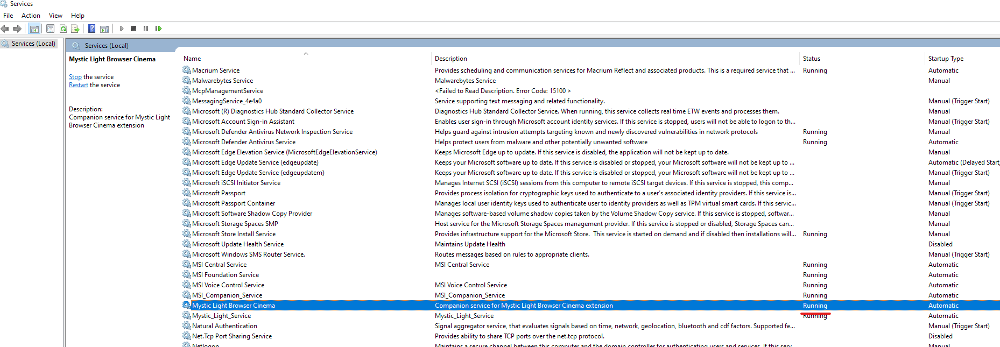
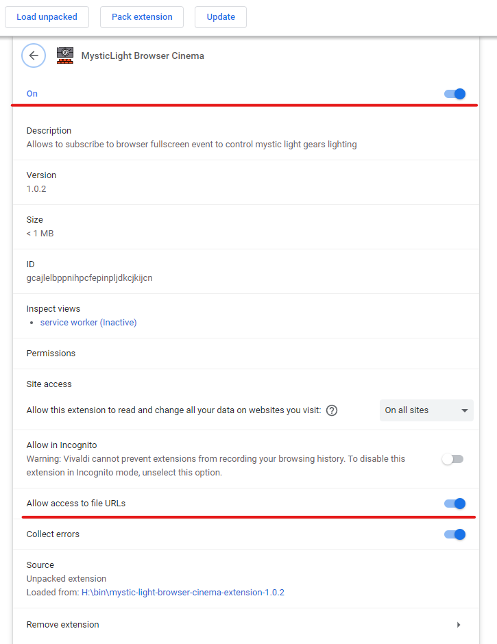

# MysticLight Browser Cinema

Extension for Chromium-based browsers (Chromium, Chrome, Vivaldi, Edge, Yandex.Browser) that allows to disable lighting effects of your Mystic Light compatible (mostly comes under MSI trademark) RGB peripherals and components on event when browser enters fullscreen mode.

> Works only with installed [Mystic Light](https://www.msi.com/Landing/mystic-light-rgb-gaming-pc/mystic-light) and [companion app](#native-app) on Windows

&nbsp;

## Why?

Having gaming peripherals and components with fancy RGB led feels great, but it might become annoying while you are trying to watch movies or youtube videos. This extension just allows to automatically disable lighting of these devices when browsers enters fullscreen mode. When browsers leaves fullscreen your device settings will restore to previous state before fullscreen event.

&nbsp;

&nbsp;

&nbsp;

## Is my device supported?

- check your device info - if there any mention of "Mystic Light" then most likely it is supported
- you can check the [Mystic Light compatible products](https://www.msi.com/Landing/mystic-light-rgb-gaming-pc/compatible-products)
- if you have installed "Dragon Center" or "MSI Center" app you will see your device on the Mystic Light tab if it is supported

&nbsp;

&nbsp;

&nbsp;

&nbsp;

## Setup

1. Make sure you have installed "MSI SDK" program installed on your device. This program is installed with either "Dragon Center" or "MSI Center" app - you can find download links [here](https://www.msi.com/Landing/mystic-light-rgb-gaming-pc/download).
2. Install [native-app](#native-app)
3. Install [browser extension](#browser-extension)

### Native app

1. Go to [releases page](https://github.com/meskill/mystic-light-browser-cinema/releases)
2. Find latest release
3. Locate download link with `Native-app installer` and click on it
4. After download run it to install native app

To verify that everything is set correctly:
1. Press `Win + R`, type `services.msc`, press enter
2. Locate `Mystic Light Browser Cinema` service
3. If it shows state `Running` then native-app is working

  

### Browser extension

1. Install `MysticLight Browser Cinema` extension from [github releases page](https://github.com/meskill/mystic-light-browser-cinema/releases)
2. Navigate to `chrome://extensions` and click "Details" on the newly installed extension.
3. Scroll down and make sure the "Allow access to file URLs" is enabled.

To verify that everything is set correctly:
1. In your browser go to `Menu -> More Tools -> Extension`
2. Locate `Mystic Light Browser Cinema` extension, click `Details`
3. Verify that extension and the "Allow access to file URLs" flag are enabled

  

## Uninstall

- Uninstall "Mystic Light Browser Extension" from your browser
- Uninstall "Mystic Light Browser Cinema" app from your system through "Add or remove programs" tab in windows settings

## Caveats

- Supports only `Windows`
- Changing device state not through MysticLight app wont be detected by the extension and that will mess up the lighting for you. So prefer to change light effects only through MSI app.
- Only default `%ProgramData%` location is supported. E.g. `C:\\ProgramData`

## Troubleshooting

### Browser extension shows alert with error "native-app not found"

Make sure you have installed [native-app](#native-app) and it is running:
- open start menu
- type "Services"
- open Services app
- locate "Mystic Light Browser Cinema" service
- make sure it is in "Running" state. If not try to start it manually
- if it doesn't help follow [this instruction](#no-answer-on-my-question)

### Device state doesn't reflect browser mode

Make sure you have followed [setup instruction](#setup) and have installed "MSI SDK" and native-app.

If you have everything installed follow [this instruction](#no-answer-on-my-question)

### No answer on my question

Please create Issue on [GitHub](https://github.com/meskill/mystic-light-browser-cinema/issues) with detailed report.

Provide next information:
- screenshot of opened MSI app that shows your MysticLight compatible devices
- screenshot of opened Windows Services app that shows that you have running "Mystic Light Browser Cinema" service
- send as an archive the logs from "C:\ProgramData\Mystic Light\Mystic Light Browser Cinema\logs" folder

## How does it work

You can find additional information in the related docs:

- [Browser extension](./chrome-extension/README.md)
- [Native-app](./native-app/README.md)

## Related Projects

- [Steelseries Browser Cinema](https://github.com/meskill/steelseries-browser-cinema) - similar extension but only for Steelseries devices

## Credits

### Icons

Icons made by [Freepik](https://www.freepik.com) from [www.flaticon.com](https://www.flaticon.com/)